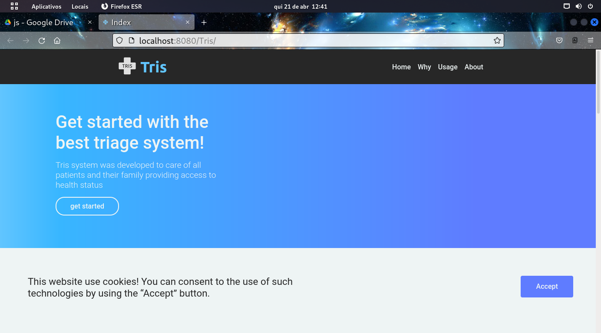
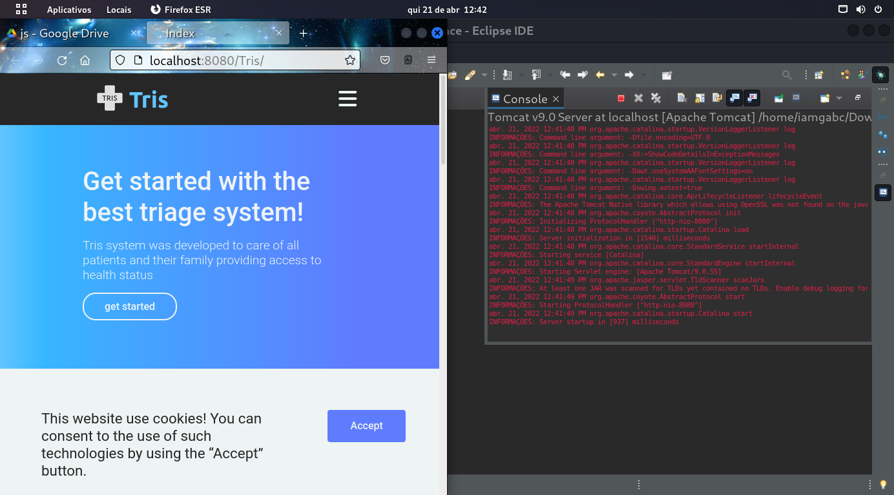
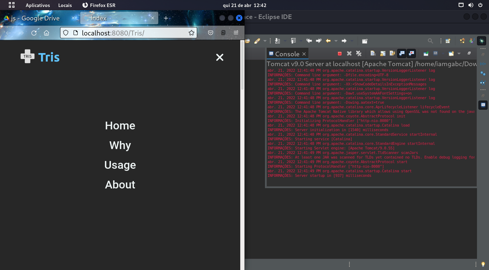
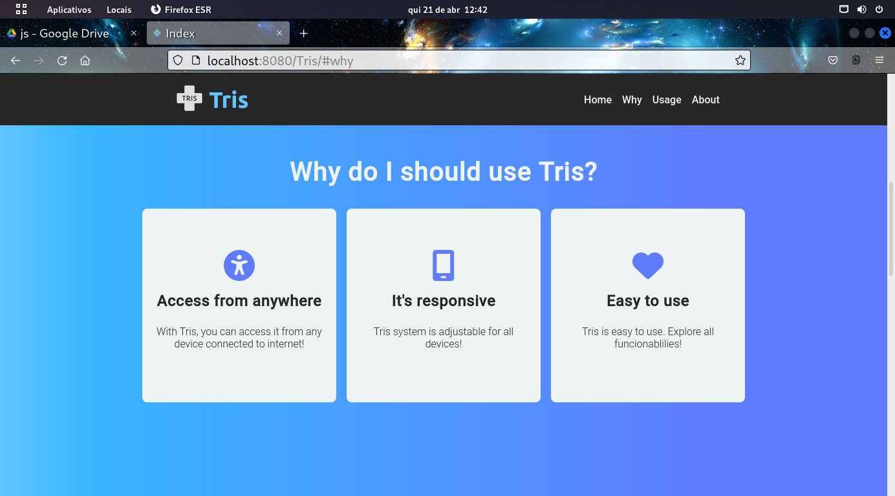
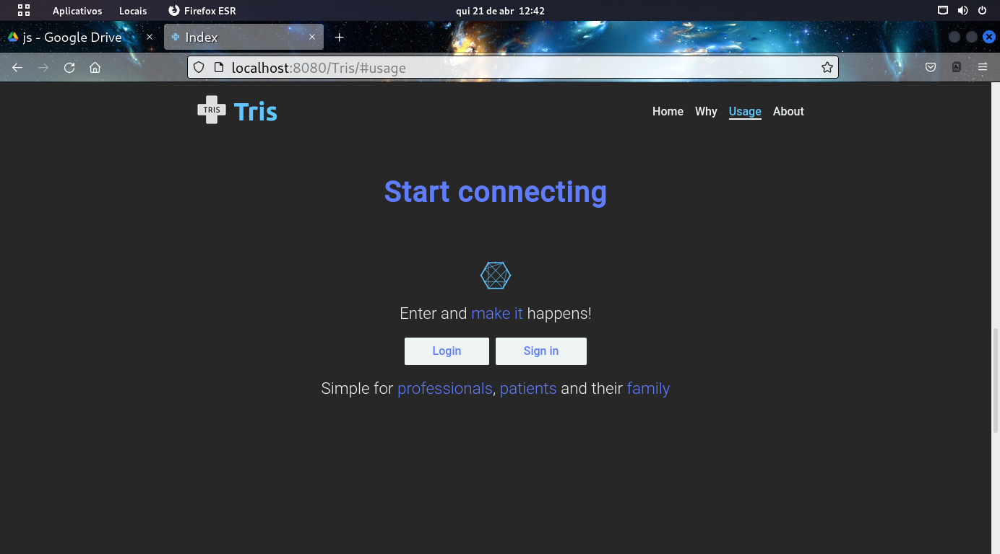
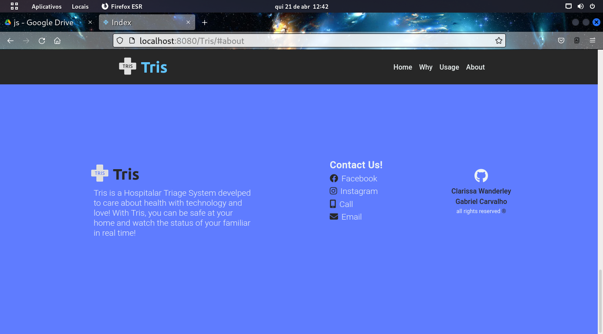
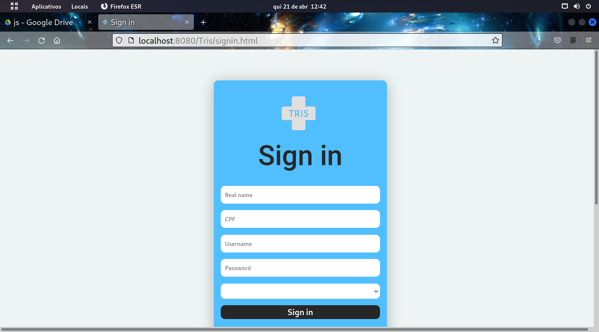
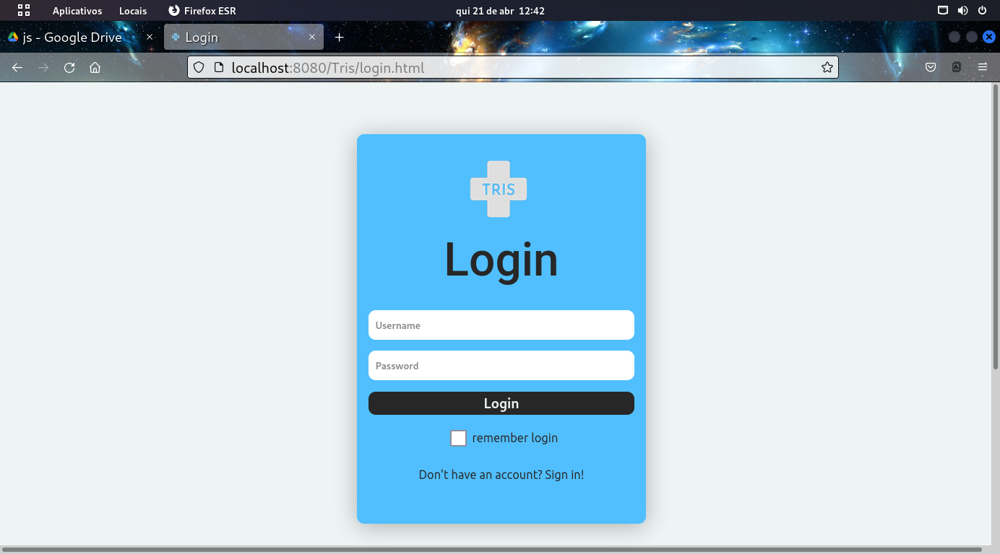
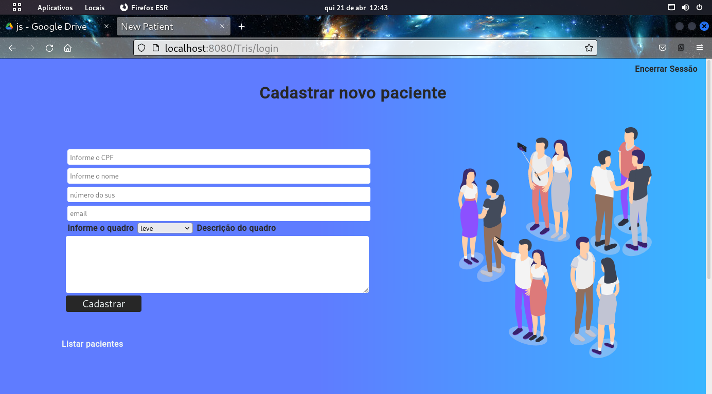
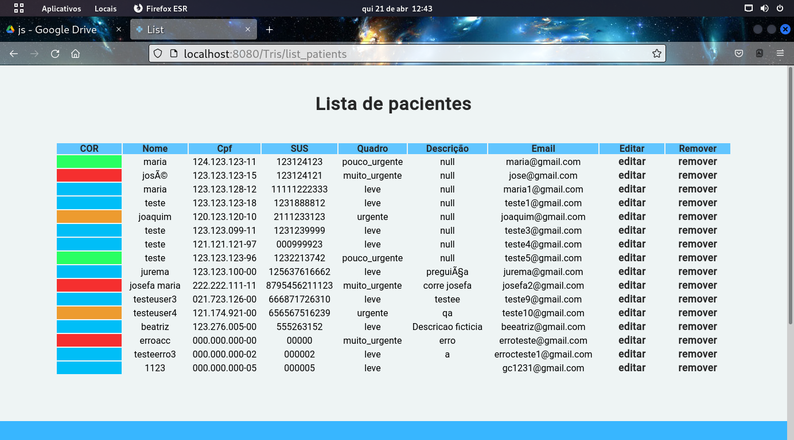

  

    <code></code>
  

<h1 >Tris Hospital Triage System</h1>

 
    <h2>IFPE- <i>Campus Garanhuns</i></h2>  
    
Powered by

    <a href="https://github.com/GabPhoenix">Gabriel Carvalho</a>  
    <a href="https://github.com/Clary04/">Clarissa Vanderley</a>

    <h2>Video</h2>
  

    <iframe width="560" height="315" src="https://www.youtube.com/embed/GdXnat4eKp8" title="YouTube video player" frameborder="0" allow="accelerometer; autoplay; clipboard-write; encrypted-media; gyroscope; picture-in-picture" allowfullscreen></iframe>
  

    <h2>Screenshots</h2>
     
    

        
         
        
         
        
         
        
         
        
         
        
         
        
         
        
         
        
         
        
         
        
    

