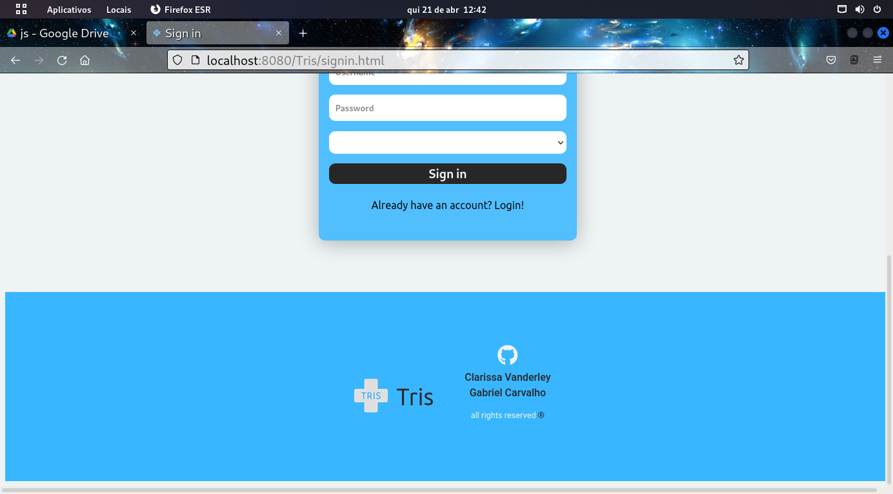

  

    <code></code>
  

<h1 >Tris Hospital Triage System</h1>

 
    <h2>IFPE- <i>Campus Garanhuns</i></h2>  
    
Powered by

    <a href="https://github.com/GabPhoenix">Gabriel Carvalho</a>  
    <a href="https://github.com/Clary04/">Clarissa Vanderley</a>

## video
 
https://user-images.githubusercontent.com/80786139/164506013-bf21aef9-7004-44a0-a90e-c726280070ca.mp4

    <h2>Screenshots</h2>
     
    

        
         
        
         
        
         
        
         
        
         
        
         
        
         
        
         
        
         
        
         
        
    

